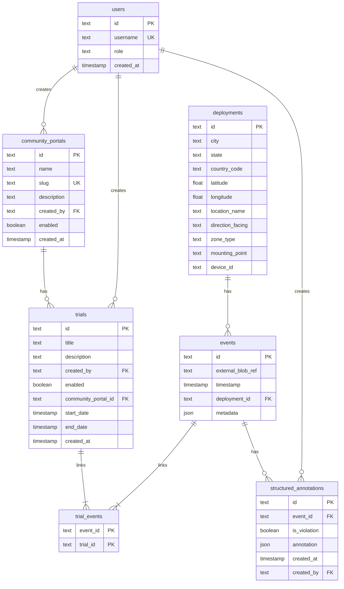
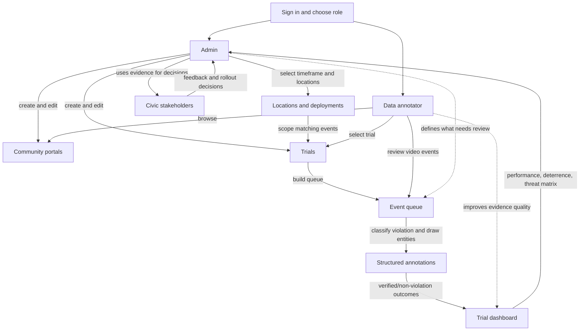

# Automatic Traffic Enforcement (ATE) Trials App

An MVP for managing Automatic Traffic Enforcement trial programs, reviewing trial outcomes, and supporting data annotators as they classify event violations.

Live demo: <https://ate-trials.apps.umernaeem.com/>

Async Walkthrough: <https://www.loom.com/share/7ab45328a6624973af7d8956979c756e>

## Setup

You can either use the live demo above or run the app locally.

Prerequisites:

- [Bun](https://bun.sh/) installed locally.

First-time local setup:

```bash
cp .env.example .env
bun i
bun db:push
bun db:seed
bun run dev
```

The development server runs on port `3000` by default.

For a production build:

```bash
bun run build
```

Use `bun db:push` when the local SQLite schema needs to be pushed, and `bun db:seed` for first-time seed data.

## Features And Decisions

- Simple RBAC-based authentication with two roles: `admin` and `data annotator`.
- Username-only sign-in for the MVP. There is no password flow yet.
- Auth state uses a simple ID-based HTTP-only cookie for straightforward session management.
- SQLite is used for operational simplicity and easy deployment.
- Admin users can create, edit, and view community portals and trials, and can access dashboards.
- Data annotators can view portals and trials, and can access the data annotation tool for events.
- Trial dashboards use high-quality visualizations designed to tell a narrative about trial performance.
- The data annotation tool supports violation classification, keyboard shortcuts for faster workflows, and progress feedback as a small gamified reward loop for annotators.
- Trial creation supports location-based filtering so trials can be scoped to relevant events.

## Database schema

Entity relationships for the SQLite schema defined in `src/db/schema.ts`:



## User flow overview

At a quick glance, admins set up the trial context and review outcomes, while data annotators convert raw event queues into structured evidence that powers the dashboards.



## Production Grade Considerations

If this were production grade, I would invest in:

- Clean architecture with stronger separation of concerns across controllers, services, data access, and presentation layers.
- PostgreSQL or another production-grade database for heavier workloads and operational reliability.
- End-to-end tests with Playwright for core user flows.
- Inversion of control and dependency injection to make services easier to mock and test.
- A real event raw blob service. The current version uses mocked event blob behavior.
- An external service or ETL pipeline to sync events from existing systems into this app.
- Proper timezone handling for all date and time behavior.
- Production-ready authentication, authorization, session expiry, and credential management.
- Queue handling for data annotation, using optimistic locks or a partitioning/assignment strategy so two annotators do not receive the same event from the same queue.
- Dashboard enhancements beyond the current trial-level view.
- Dashboard support at the community portal and location levels, alongside the existing trial-level dashboards.
- A formal design system with tokens for visual consistency, potentially using a more enterprise-grade UI library such as Ant Design.

## Goodies With More Time

These are enhancements I would explore with more time. Some are production-oriented, while others are advanced product ideas:

- An integrated AI chatbot on the dashboard that acts as an analysis agent, generates and runs custom queries on demand, and creates visualizations. This would be an advanced or beta feature.
- Toast messages for success and failure feedback.
- Optimistic updates for a snappier UI.
- Stats per community portal and stats per trial.
- Preloading video streams for queued data annotation events to reduce wait time, especially because videos are high quality and large.
- Adaptive video streaming so annotators can work with lower-quality streams when bandwidth is limited and switch to high quality when needed. This would require significant infrastructure and compute.
- Campaign creation for data annotators, or an invite-based system for sending annotation invites.
- Efficiency and KPI tracking for data annotators, including recognition or gamification-based incentives where financial incentives are not involved.
- Cross-checks in the data annotation tool to reduce misuse and invalid annotations.
- Rate limits and stricter anti-spam and abuse policies for the data annotation tool.

## Dashboard Narrative & Visualization Strategy

The design of the Trial Dashboard is intentionally constructed to address the unique political and economic realities of the B2G (Business-to-Government) automated traffic enforcement sector. A trial is not merely a dataset; it is a diagnostic instrument and a sales mechanism. The dashboard is engineered to tell a persuasive, psychological story to secure executive and municipal buy-in.

### The Business Context & The Deterrence Paradox

The automated enforcement business model operates on a "self-consuming economic engine". If the product works perfectly, it rapidly changes driver behavior, which decreases violations and consequently destroys its own citation revenue over time—a phenomenon known as the **Deterrence Paradox**.

### Target Audience & Core Concerns

The primary consumers of this dashboard are civic stakeholders, city councils, and police chiefs. Their primary hesitation in adopting automated enforcement is the **"Predatory" Objection**—the fear that cameras are simply "bounty hunting" mechanisms designed to farm communities for cash.

To succeed, the dashboard must empirically prove that the system prioritizes public safety and behavioral correction, rather than infinite revenue generation. Every visualization was chosen to neutralize these political objections and validate the severity of the localized threat.

### Why These Visualizations Were Chosen

**1. The Executive Scorecard (The Baseline Threat)**

- **What it is:** High-level KPI metrics displaying _Total Events Analyzed_, _Verified Violations_, _Non-Compliance Rate_, and _Severe Infractions_.
- **The Purpose:** City councils respond to easily digestible risk metrics. This establishes the immediate scale of the civic danger. By explicitly isolating "Severe Infractions" (e.g., red-light violations), it proves the system understands that not all violations are equal and prioritizes life-threatening behavior over minor infractions.

**2. The Deterrence Curve (The Anti-Predatory Proof)**

- **What it is:** A line chart plotting the volume of daily violations over the course of the 30-day trial.
- **The Purpose:** This is the most critical chart for overcoming the "predatory revenue" objection. By visually demonstrating a steep downward decay curve, it proves that the camera's presence alone acts as a psychological deterrent. It reframes the narrative from "revenue generation" to "active behavioral correction," proving the system fixes the problem rather than permanently taxing the community.

**3. The Threat Matrix (The Emotional Trigger)**

- **What it is:** A temporal heatmap/bar chart displaying violations by the hour of the day, specifically pre-filtered for sensitive zones like school zones.
- **The Purpose:** Abstract numbers do not drive municipal action; visceral danger does. High violation rates clustering around 7:30 AM – 8:30 AM correlate directly with school drop-off hours. This visualization is a strategic emotional trigger that shifts the political conversation entirely away from revenue and centers it on protecting children.

**4. Violation & Zone Distributions (Contextualizing Kinematic Danger)**

- **What it is:** Breakdown charts categorizing the types of violations (e.g., speeding vs. failure-to-yield) and the physical zones where they occur.
- **The Purpose:** Categorizing the kinematic danger proves the system isn't nitpicking harmless behaviors. Emphasizing high-severity offenses validates the system's objective fairness and justifies its permanent deployment.
